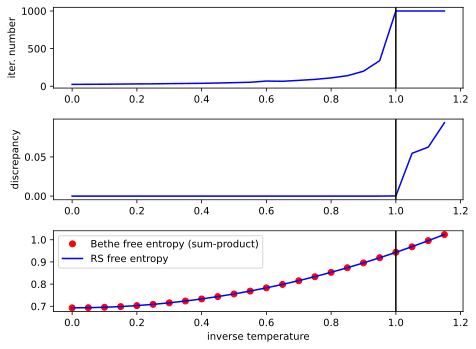

# Loopy belief propagation: Sherrington Kirkpatrick model's free entropy

_A complete code of the example is available in_ `./examples/sk.rs`.
_Simply run `cargo run --release --example sk -- --help` to get a manual on a CLI interface of the example_. _To plot the figures from this page, simply execute a python script `./examples/sk_plotter.py`_.

In this example we calculate a free entropy of a Sherrington Kirkpatrick (SK) model by a loopy belief propagation algorithm for a replica symmetric phase. The free entropy is one of the most important thermodynamic potentials that determines physical properties of a system and often is a final goal of an analytical or numerical calculations. First, we need to remind a reader what the SK model and the free entropy are. Let \\( \mathbf{x} \in \\{+1,-1\\}^N\\) be a configuration of \\( N \\) spins. We define a probability measure over all those configurations as follows \\[ p[\mathbf{x}|J, \beta] =  \frac{1}{Z(J, \beta)}\exp\left\\{\sum_{i>j} \beta J_{ij}x_ix_j\right\\},\\] where \\(x_i\\) is the \\( i\\)-th entry of \\( \mathbf{x} \\), \\( Z(J, \beta) \\) is the partition function (normalization constant), \\( \beta \\) is the inverse temperature and \\( J_{ij} \\) is an element of a coupling constants matrix \\( J \\). Coupling constants are i.i.d. random variables, each of them is sampled from the normal distribution \\( {\cal N}\left(0, \frac{1}{\sqrt{N}}\right) \\). As one can see, \\( p[\mathbf{x}|J, \beta] \\) is a Gibbs measure describing a spin system with Ising like coupling of all \\(\frac{N(1 - N)}{2}\\) pairs of spins. We would be interested in averaged over \\( J \\) free entropy of the SK model, that reads \\[\langle\Phi(\beta)\rangle = \sqrt{\frac{N}{2\pi}}^{\frac{N(N-1)}{2}}\int\prod_{i>j} dJ_{ij}\exp\left(-\frac{N}{2}\sum_{i>j}J_{ij}^2\right)\log(p[\mathbf{x}|J, \beta]).\\] SK model is exactly solvable in the thermodynamic limit (\\( N\to\infty\\)). For \\( 0 < \beta < 1 \\) (high temperatures) the SK model is in the replica symmetric phase and its exact free entropy takes the following form \\[\langle\Phi(\beta)\rangle = \frac{\beta^2}{4} + \log(2).\\] \\( \beta = 1\\) is the phase transition point where replica symmetry breaks. For \\(\beta > 1\\) we do not discuss the SK model behaviour in order to simplify the discussion and since the belief propagation algorithm does not converge in this region. For further understanding of the analytical approach to the SK model and some other spin glass models we refer the reader to p. 143-164 of [Part B](https://web.stanford.edu/~montanar/RESEARCH/BOOK/partB.pdf) of [Information, Physics, and Computation book](https://web.stanford.edu/~montanar/RESEARCH/book.html) by Marc Mézard and Andrea Montanari.

We are going to calculate the free entropy numerically, using the loopy belief propagation algorithm. One useful property of the SK model is _self-averaging_ which states that the thermodynamic properties of \\( p[\mathbf{x}|J, \beta] \\) are identical for all \\( J \\) sampled from \\( {\cal N}\left(0, \frac{1}{\sqrt{N}}\right) \\). This allows us to calculate the free entropy value for a single sample of \\( J \\) and it would coincide with averaged value with high precision given \\( N \\) is sufficiently large.

Now let us turn to the code, `gmrs` library contains an implementation of a factor graph for Ising type models. Each factor in this graph is an exponent of the following kind \\[ \psi_{J, b_1, b_2}(x_1, x_2) = \exp(Jx_1x_2 + b_1 x_1 + b_2 x_2),\\] where \\( J \\) is a coupling constant, \\( b_1 \\) is a magnetic field acting on the first spin and \\( b_2 \\) is a magnetic field acting on the second spin. One can build a sample of the SK model unnormalized probability measure from these factors as follows: \\[ p[\mathbf{x}|J, \beta]\propto\prod_{i>j} \psi_{\beta J_{ij}, 0,0}(x_i, x_j),\\] where \\( J_{ij} \\) is sampled using a random numbers generator. Let us implement this factor graph in code. First, let us bring to the scope all the necessary objects:
```rust
use gmrs::{
    ising::{new_ising_builder, random_message_initializer, IsingFactor, SumProduct},
    ising::schedulers::{get_standard_factor_scheduler, get_standard_variable_scheduler},
};
use rand::thread_rng;
use rand_distr::{Distribution, Normal};
```
Here `new_ising_builder` is a function returning builder object for an Ising factor graph, `random_message_initializer` is a function that creates an `initializer` for initial values of messages, `IsingFactor` is an Ising factor data type, `SumProduct` is a message passing type and `get_standard_factor_scheduler` and `get_standard_variable_scheduler` are functions returning objects for scheduling algorithm's hyper-parameters during the belief propagation runtime. All other object are necessary for generating couplings and initial values of messages at random.

Next, we define parameters of a problem:
```rust
// number of spins in SK model
let spins_number = 1000;
// inverse temperature
let beta = 0.9;
// threshold of the convergence criterion
let error = 1e-6;
// maximal number of message passing iterations
let max_iter = 1000;
// mean value of coupling constants
let mu = 0f64;
// std of coupling constants
let std = beta / (spins_number as f64).sqrt();
// distribution of coupling constants
let distr = Normal::new(mu, std).unwrap();
// a scheduler for factor's messages update rules
let factor_scheduler = get_standard_factor_scheduler(0.5);
// a scheduler for variable's messages update rules
let variable_scheduler = get_standard_variable_scheduler(0.5);
// this generator is used to sample coupling constants
let mut rng_couplings = thread_rng();
// messages initializer
let mut initializer = random_message_initializer(thread_rng(), -0.5, 0.5);
```
All the parameters are self-explanatory, except `factor_scheduler`, `variable_scheduler` and `initializer`. `factor_scheduler` and `variable_scheduler` are schedulers that return hyper-parameters of the belief propagation algorithm given the current iteration number. In the particular case they simply return an [exponential smoothing parameter](https://en.wikipedia.org/wiki/Exponential_smoothing) for messages' updates equal to `0.5` for any iteration. `initializer` is just an object that randomly initializes messages at the start of the algorithm.

Now we are ready to build a factor graph:
```rust
let mut fgb =
        new_ising_builder::<SumProduct>(spins_number, (spins_number - 1) * spins_number / 2);
    for i in 0..spins_number {
        for j in (i + 1)..spins_number {
            fgb.add_factor(
                IsingFactor::new(distr.sample(&mut rng_couplings), 0f64, 0f64),
                &[i, j],
                &mut initializer,
            )
            .unwrap();
        }
    }
    let mut fg = fgb.build();
```
Here first we create a factor graph with `spins_number` variables and memory allocated for `(spins_number - 1) * spins_number / 2` factors. Then, in two `for` loops we connect each two variables by an Ising factor with random coupling constant, one can check that this loop is in one-to-one correspondence with the formula for the probability measure \\( p[\mathbf{x}|J, \beta]\propto\prod_{i>j} \psi_{\beta J_{ij}, 0,0}(x_i, x_j)\\). Finally, by the `.build()` method we create a factor graph from a builder.

Now we are ready to run the message passing and print its convergence info:
```rust
let info = fg
    .run_message_passing_parallel(
        max_iter,
        0,  // minimal number of iterations
        error,
        &factor_scheduler,
        &variable_scheduler
    );
    .unwrap();
println!("{}", info);
```
Readers, who are not well familiar with the loopy belief propagation algorithm we refer to [Part D](https://web.stanford.edu/~montanar/RESEARCH/BOOK/partD.pdf) of [Information, Physics, and Computation book](https://web.stanford.edu/~montanar/RESEARCH/book.html).

After the convergence of the algorithm we can compute all the single- and two-spins approximate marginal distributions, i.e. \\[p[x_i|J, \beta] = \int \prod_{k\neq x_i} dx_k p[\mathbf{x}|J, \beta], \\\\ p[x_i, x_j|J, \beta] = \int \prod_{k\neq x_i, x_j} dx_k p[\mathbf{x}|J, \beta],\\] by calling the following methods
```rust
let variable_marginals = fg.variable_marginals();
let factor_marginals = fg.factor_marginals();
```
Here `variable_marginals` is a vector of `Array1` objects from [`ndarray` carte](https://docs.rs/ndarray/latest/ndarray/) for each variable (spin), each array is \\( p[x_i|J, \beta] \\) distribution for a particular variable. `factor_marginals` is a vector of `Array2` objects for each factor, each array is \\( p[x_i, x_j|J, \beta] \\) distribution of a particular factor.

We also can get all the factors as `Array2` objects as follows
```rust
let factors = fg.factors();
```
Here `factors` is a vector of `Array2` objects, each array is a particular factor \\(\psi_{\beta J_{ij}, 0,0}(x_i, x_j)\\).

Having all the marginal distributions \\(p[x_i|J, \beta]\\), \\(p[x_i, x_j|J, \beta]\\) and factors \\(\psi_{\beta J_{ij}, 0,0}(x_i, x_j)\\) we can calculate a Bethe free-entropy per spin as follows \\[\small{F(\beta) = \frac{1}{N}\left((N - 2)\sum_i \sum_{x_i} p[x_i|J, \beta] \log(p[x_i|J, \beta])-\sum_{i>j} \sum_{x_i, x_j} p[x_i, x_j|J, \beta]\log\left[\frac{p[x_i, x_j|J, \beta]}{\psi_{\beta J_{ij}, 0,0}(x_i, x_j)}\right]\right)},\\] in code it takes the following form
```rust
let mut bethe_free_entropy = 0f64;
for (fm, f) in factor_marginals.iter().zip(&factors) {
    bethe_free_entropy -= (fm * (fm / f).mapv(f64::ln)).sum();
}
for vm in &variable_marginals {
    bethe_free_entropy += ((spins_number - 2) as f64) * (vm * vm.mapv(f64::ln)).sum();
}
bethe_free_entropy /= spins_number as f64;
```

The Bethe free entropy is not equal to the free entropy in general case, but in our case, where interaction graph is fully connected, the Bethe free entropy is a very good approximation of the free entropy. We are going to compare the Bethe free entropy with the exact free entropy for Replica symmetric phase. Exact free entropy for this phase can be computed by calling the following function
```rust
/// Returns a replica symmetric free entropy
/// (valid for high temperature, beta < 1)
fn rs_sk_free_entropy(beta: f64) -> f64 {
    0.25 * beta.powi(2) + f64::ln(2f64)
}
```
Then, we can plot the comparison for different `beta` and also plot some other important metrics of the belief propagation algorithm in order to see how the algorithm converges for different values of `beta`. You can get the same plots by calling the plotting script `./examples/sk_plotter.py`. Plots are given below



The vertical black line in all plots highlights the replica symmetry breaking phase transition point. The top plot shows the number of message passing iterations passed until convergence. One can note, that after the symmetry breaking point the algorithm performs the maximal number of iteration and does not converge. The middle plot shows the discrepancy between subsequent messages for the last and one prior to the last iterations. For the converged algorithm this discrepancy is equal to machine zero, but as one can see, for the broken symmetry region it is finite that is another evidence that algorithm has not converged. The bottom plot shows the Bethe free entropy (red dots) and the exact free entropy for Replica symmetric phase (blue curve). One can note, that the Bethe free entropy coincides with the exact free entropy for the replica symmetric phase. For broken replica symmetry both curves have no sense since the analytical one is valid only for the symmetric phase and the belief propagation does not converge in the symmetry brocken phase.